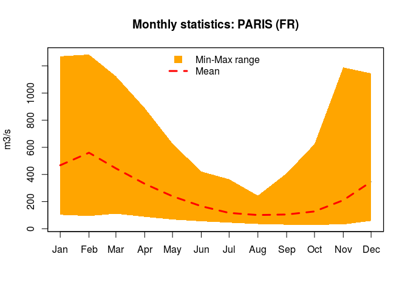
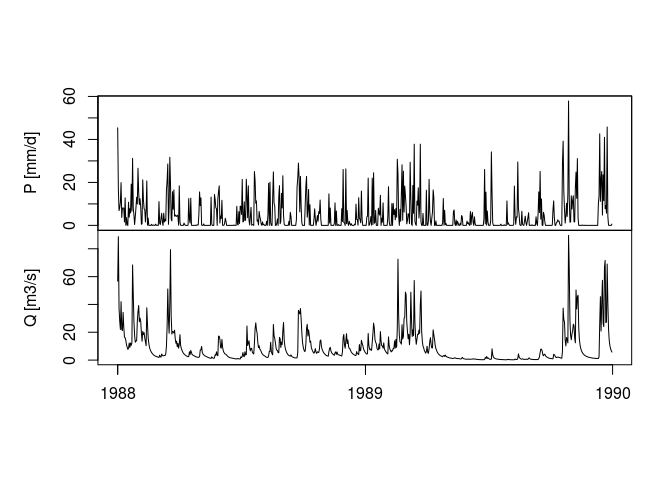
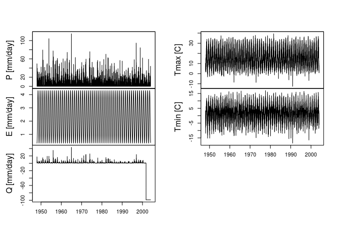
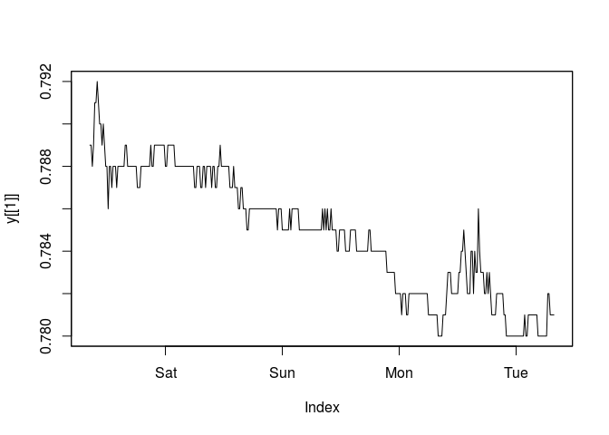
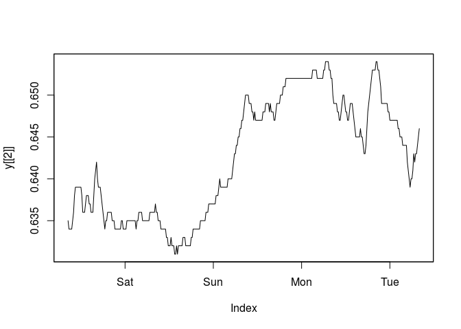
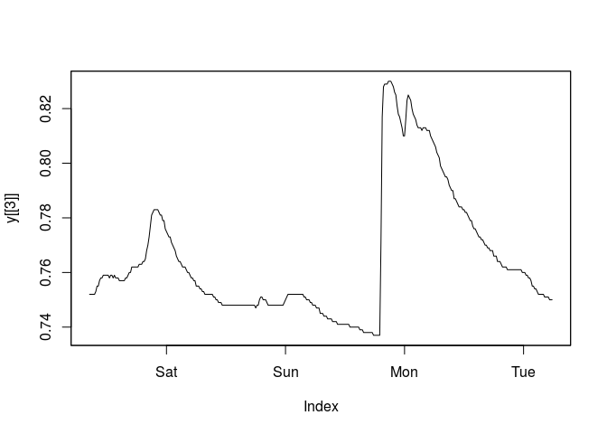
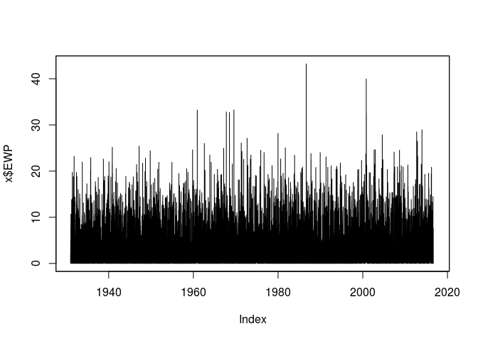

-   [hddtools: Hydrological Data Discovery Tools](#hddtools-hydrological-data-discovery-tools)
    -   [Dependencies & Installation](#dependencies-installation)
    -   [Data sources and Functions](#data-sources-and-functions)
        -   [The Koppen Climate Classification map](#the-koppen-climate-classification-map)
        -   [The Global Runoff Data Centre](#the-global-runoff-data-centre)
        -   [NASA's Tropical Rainfall Measuring Mission (TRMM, only available for github version)](#nasas-tropical-rainfall-measuring-mission-trmm-only-available-for-github-version)
        -   [Top-Down modelling Working Group (Data60UK and MOPEX)](#top-down-modelling-working-group-data60uk-and-mopex)
        -   [SEPA river level data](#sepa-river-level-data)
        -   [Met Office Hadley Centre Observation Data: HadUKP Data](#met-office-hadley-centre-observation-data-hadukp-data)
    -   [T&C](#tc)
    -   [Meta](#meta)

<!-- Edit the README.Rmd only!!! The README.md is generated automatically from README.Rmd. -->
hddtools: Hydrological Data Discovery Tools
===========================================

[](https://zenodo.org/badge/latestdoi/9118/cvitolo/hddtools) [](https://travis-ci.org/cvitolo/hddtools) [](https://ci.appveyor.com/project/cvitolo/hddtools) [](https://cran.r-project.org/package=hddtools) [](https://cran.r-project.org/package=hddtools) [](https://cran.r-project.org/package=hddtools)

**hddtools** stands for Hydrological Data Discovery Tools. This R package is an open source project designed to facilitate non-programmatic access to a variety of online open data sources relevant for hydrologists and, more in general, environmental scientists and practitioners.

This typically implies the download of a metadata catalogue, selection of information needed, formal request for dataset(s), de-compression, conversion, manual filtering and parsing. All those operation are made more efficient by re-usable functions.

Depending on the data license, functions can provide offline and/or online modes. When redistribution is allowed, for instance, a copy of the dataset is cached within the package and updated twice a year. This is the fastest option and also allows offline use of package's functions. When re-distribution is not allowed, only online mode is provided.

Dependencies & Installation
---------------------------

The hddtools package depends on other CRAN packages. Check for missing dependencies and install them using the commands below:

``` r
packs <- c('zoo', 'sp', 'RCurl', 'XML', 'rnrfa', 'Hmisc', 'raster', 
           'stringr', 'devtools')
new.packages <- packs[!(packs %in% installed.packages()[,'Package'])]
if(length(new.packages)) install.packages(new.packages)
```

You can install this package from CRAN:

``` r
install.packages('hddtools')
```

Or you can install the development version from Github with [devtools](https://github.com/hadley/devtools):

``` r
devtools::install_github('cvitolo/hddtools')
```

Load the hddtools package:

``` r
library('hddtools')
```

Data sources and Functions
--------------------------

The functions provided can filter, slice and dice 2 and 3 dimensional information.

``` r
# Define a bounding box
bbox <- list(lonMin=-10,latMin=48,lonMax=5,latMax=62)

# Define a temporal extent
timeExtent <- seq(as.Date('2012-01-01'), as.Date('2012-03-31'), by='months')
```

### The Koppen Climate Classification map

The Koppen Climate Classification is the most widely used system for classifying the world's climates. Its categories are based on the annual and monthly averages of temperature and precipitation. It was first updated by Rudolf Geiger in 1961, then by Kottek et al. (2006), Peel et al. (2007) and then by Rubel et al. (2010).

The package hddtools contains a function to identify the updated Koppen-Greiger climate zone, given a bounding box.

``` r
# Extract climate zones from Peel's map:
KGClimateClass(bbox,updatedBy='Peel')
#>   ID Class Frequency
#> 1  9   Csb         1
#> 2 15   Cfb      6199
#> 3 16   Cfc        10
#> 4 27   Dfc         3
#> 5 29    ET         1

# Extract climate zones from Kottek's map:
KGClimateClass(bbox,updatedBy='Kottek')
#>   ID Class Frequency
#> 1 32   Cfb     12301
#> 2 33   Cfc       507
```

### The Global Runoff Data Centre

The Global Runoff Data Centre (GRDC) is an international archive hosted by the Federal Institute of Hydrology (Bundesanstalt für Gewässerkunde or BfG) in Koblenz, Germany. The Centre operates under the auspices of the World Meteorological Organisation and retains services and datasets for all the major rivers in the world.

Catalogue, kml files and the product \`\`Long-Term Mean Monthly Discharges'' are open data and accessible via the hddtools.

``` r
# GRDC full catalogue
x <- catalogueGRDC()

# Filter GRDC catalogue based on a bounding box
x <- catalogueGRDC(bbox=bbox, metadataColumn='statistics', entryValue=1)

# Visualise outlets on an interactive map
library(leaflet)
leaflet(data = x) %>%
  addTiles() %>%  # Add default OpenStreetMap map tiles
  addMarkers(~Longitude, ~Latitude, popup=~name)
```


``` r
# Monthly data extraction
y <- tsGRDC(stationID='6122300', plotOption=TRUE)
```



### NASA's Tropical Rainfall Measuring Mission (TRMM, only available for github version)

The Tropical Rainfall Measuring Mission (TRMM) is a joint mission between NASA and the Japan Aerospace Exploration Agency (JAXA) that uses a research satellite to measure precipitation within the tropics in order to improve our understanding of climate and its variability.

The TRMM satellite records global historical rainfall estimation in a gridded format since 1998 with a daily temporal resolution and a spatial resolution of 0.25 degrees. This information is openly available for educational purposes and downloadable from an FTP server.

The hddtools provides a function, called , to download and convert a selected portion of the TRMM dataset into a raster-brick that can be opened in any GIS software.

``` r
# Retreive mean monthly precipitations from 3B43_V7 (based on a bounding box and time extent)
TRMM(timeExtent = timeExtent, bbox = bbox)
library(raster)
b <- brick('trmm_acc.tif')
plot(b)
```


### Top-Down modelling Working Group (Data60UK and MOPEX)

The Top-Down modelling Working Group (TDWG) for the Prediction in Ungauged Basins (PUB) Decade (2003-2012) is an initiative of the International Association of Hydrological Sciences (IAHS) which collected datasets for hydrological modelling free-of-charge, available [here](http://tdwg.catchment.org/datasets.html). This package provides a common interface to retrieve, browse and filter information.

#### The Data60UK dataset

The Data60UK initiative collated datasets of areal precipitation and streamflow discharge across 61 gauging sites in England and Wales (UK). The database was prepared from source databases for research purposes, with the intention to make it re-usable. This is now available in the public domain free of charge.

The hddtools contain two functions to interact with this database: one to retreive the catalogue and another to retreive time series of areal precipitation and streamflow discharge.

``` r
# Data60UK full catalogue
x <- catalogueData60UK()

# Filter Data60UK catalogue based on bounding box
bbox <- list(lonMin=-4,latMin=51,lonMax=-3,latMax=53)
x <- catalogueData60UK(bbox)
```

``` r
# Visualise outlets on an interactive map
library(leaflet)
leaflet(data = x) %>%
  addTiles() %>%  # Add default OpenStreetMap map tiles
  addMarkers(~Longitude, ~Latitude, popup=~Location)
```


``` r
# Extract time series 
hydroRefNumber <- as.numeric(as.character(x$id[1])) # e.g. 55012
y <- tsData60UK(hydroRefNumber, plotOption=FALSE)

# Extract time series for a specified temporal window
timeExtent <- seq(as.Date('1988-01-01'), as.Date('1989-12-31'), by='days')
y <- tsData60UK(hydroRefNumber, plotOption=TRUE, timeExtent)
```



#### MOPEX

US dataset containing historical hydrometeorological data and river basin characteristics for hundreds of river basins from a range of climates throughout the world.

``` r
# MOPEX full catalogue
x <- catalogueMOPEX()

# Extract time series 
y <- tsMOPEX('14359000', plotOption=TRUE)
```



### SEPA river level data

The Scottish Environment Protection Agency (SEPA) manages river level data for hundreds of gauging stations in the UK. The catalogue of stations was derived by an unofficial list (available here: <http://pennine.ddns.me.uk/riverlevels/ConciseList.html>).

``` r
# SEPA unofficial catalogue
x <- catalogueSEPA()
```

The time series of the last few days is available from SEPA website and downloadable using the following function:

``` r
# Single time series extraction
y <- tsSEPA(hydroRefNumber = 234253, plotOption = FALSE)
```

``` r
# Multiple time series extraction
y <- tsSEPA(hydroRefNumber = c(234253, 234174, 234305))
plot(y[[1]])
```



``` r
plot(y[[2]])
```



``` r
plot(y[[3]])
```



### Met Office Hadley Centre Observation Data: HadUKP Data

The Met Office Hadley Centre provides daily precipitation time series averaged over UK regions and subregions.

``` r
# Get the list of time series (11)
x <- HadDAILY()
```

Below is the list of names used to extract time series for regions/subregions:

-   England & Wales: EWP
-   South East England: SEEP
-   South West England & Wales: SWEP
-   Central England: CEP
-   North West England & Wales: NWEP
-   North East England: NEEP
-   Scotland: SP
-   South Scotland: SSP
-   North Scotland: NSP
-   East Scotland: ESP
-   Northern Ireland: NIP

For example, here is how to plot the time series for England and Wales:

``` r
plot(x$EWP)
```



T&C
---

Please note that this project is released with a [Contributor Code of Conduct](CONDUCT.md). By participating in this project you agree to abide by its terms.

This package and functions herein are part of an experimental open-source project. They are provided as is, without any guarantee.

Meta
----

-   Please [report any issues or bugs](https://github.com/cvitolo/hddtools/issues).
-   License: [GPL-3](https://opensource.org/licenses/GPL-3.0)
-   Get citation information for `hddtools` in R doing `citation(package = 'hddtools')`

<br/>

[](http://ropensci.org)
