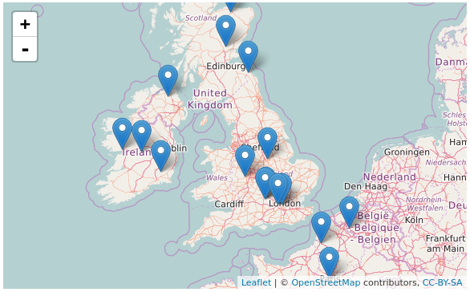
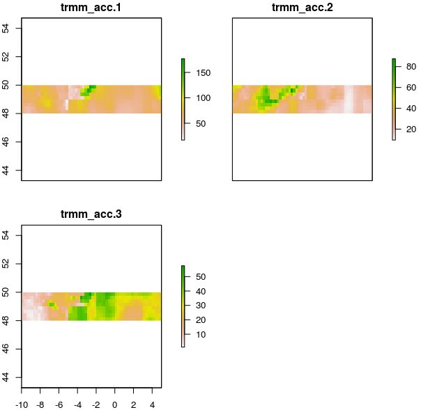
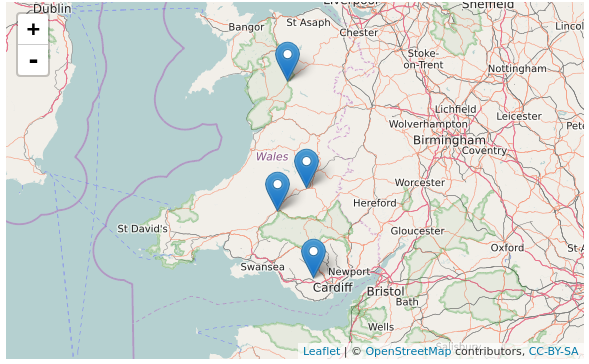

```{r echo=FALSE}
knitr::opts_chunk$set(
  comment = "#>",
  collapse = TRUE,
  warning = FALSE,
  message = FALSE,
  cache = FALSE,
  eval = FALSE
)
```

# Introduction

**hddtools** stands for Hydrological Data Discovery Tools. This R package is an open source project designed to facilitate access to a variety of online open data sources relevant for hydrologists and, in general, environmental scientists and practitioners. 

This typically implies the download of a metadata catalogue, selection of information needed, formal request for dataset(s), de-compression, conversion, manual filtering and parsing. All those operation are made more efficient by re-usable functions. 

Depending on the data license, functions can provide offline and/or online modes. When redistribution is allowed, for instance, a copy of the dataset is cached within the package and updated twice a year. This is the fastest option and also allows offline use of package's functions. When re-distribution is not allowed, only online mode is provided.

## Dependencies & Installation
The hddtools package and the examples in this vignette depend on other CRAN packages. Check for missing dependencies and install them using the commands below:

```{r}
packs <- c("zoo", "sp", "RCurl", "XML", "rnrfa", "Hmisc", "raster", 
           "stringr", "devtools", "leaflet")
new_packages <- packs[!(packs %in% installed.packages()[,"Package"])]
if(length(new_packages)) install.packages(new_packages)
```

Get the released version from CRAN:

```{r}
install.packages("hddtools")
```

Or the development version from github using [devtools](https://github.com/hadley/devtools):

```{r}
devtools::install_github("cvitolo/hddtools")
```

Load the hddtools package:

```{r, eval = TRUE}
library("hddtools")
```

## Data sources and Functions

The functions provided can filter, slice and dice 2 and 3 dimensional information. 

### The Koppen Climate Classification map
The Koppen Climate Classification is the most widely used system for classifying the world's climates. Its categories are based on the annual and monthly averages of temperature and precipitation. It was first updated by Rudolf Geiger in 1961, then by Kottek et al. (2006), Peel et al. (2007) and then by Rubel et al. (2010). 

The package hddtools contains a function to identify the updated Koppen-Greiger climate zone, given a bounding box.

```{r, eval = TRUE}
# Define a bounding box
areaBox <- raster::extent(-10, 5, 48, 62)

# Extract climate zones from Peel's map:
KGClimateClass(areaBox = areaBox, updatedBy = "Peel")

# Extract climate zones from Kottek's map:
KGClimateClass(areaBox = areaBox, updatedBy = "Kottek")
```

### The Global Runoff Data Centre
The Global Runoff Data Centre (GRDC) is an international archive hosted by the Federal Institute of Hydrology (Bundesanstalt für Gewässerkunde or BfG) in Koblenz, Germany. The Centre operates under the auspices of the World Meteorological Organisation and retains services and datasets for all the major rivers in the world. Catalogue, kml files and the product Long-Term Mean Monthly Discharges are open data and accessible via the hddtools.

Information on all the GRDC stations can be retrieved using the function `catalogueGRDC` with no input arguments, as in the examle below:  
```{r, eval = FALSE}
# GRDC full catalogue
GRDC_catalogue_all <- catalogueGRDC()
```

However, there are a number of options to filter the catalogue and return only the a subset of stations. For instance, we might be interested in subsetting only stations in Italy. As the 8th column in the catalogue lists the country codes, we can filter the catalogue passing two input arguments to the `catalogueGRDC` function: `columnName = "country_code"` and `columnValue  = "IT"`, as in the example below.
```{r}
# Filter GRDC catalogue based on a country code
GRDC_catalogue_countrycode <- catalogueGRDC(columnName = "country_code",
                                            columnValue = "IT")
```

The arguments `columnName` and `columnValue` can be used to filter over other columns. For instance, in the example below we show how to subset stations along the Po River.
```{r}
# Filter GRDC catalogue based on rivername
GRDC_catalogue_river <- catalogueGRDC(columnName = "river", columnValue = "PO")
```

Note in the example above that the search is not case sensitive, therefore you get the same result whether the columnValue is spelled "PO", "Po" or "po". Same applies for the metadata column (it can be spelled "RIVER", "river", "River"...).

If `columnName` refers to a numeric field, in the `columnValue` we can specify other terms of comparison. For example we can select all the stations for which daily data is available since 2000.
```{r}
# Filter GRDC catalogue based on numerical value, for instance select all the stations for which daily data is available since 2000
GRDC_catalogue_dstart <- catalogueGRDC(columnName = "d_start", 
                                       columnValue = ">=2000")
```

Another option is to filter the catalogue based on a geographical bounding box.
```{r}
# Define a bounding box
areaBox <- raster::extent(-10, 5, 48, 62)

# Filter GRDC catalogue based on a bounding box
GRDC_catalogue_bbox <- catalogueGRDC(areaBox = areaBox)
```

The filters can be also combined, as in the examples below.
```{r}
# Define a bounding box
areaBox <- raster::extent(-10, 5, 48, 62)

# Filter GRDC catalogue based on a bounding box plus keep only those stations where "statistics" value is 1
GRDC_catalogue_bbox_stats <- catalogueGRDC(areaBox = areaBox, 
                                           columnName = "statistics",
                                           columnValue = 1)
```

The filtered stations can be used to create a map.
```{r}
# Visualise outlets on an interactive map
library(leaflet)
leaflet(data = GRDC_catalogue_bbox_stats) %>%
  addTiles() %>%  # Add default OpenStreetMap map tiles
  addMarkers(~long, ~lat, popup = ~station)
```



Lastly, given a station ID number (this is stored in the column grdc_no of the catalogue) we can check whether monthly data is available and eventually plot it.
```{r, eval = TRUE}
# Monthly data extraction
WolfeToneBridge <- tsGRDC(stationID = catalogueGRDC()$grdc_no[7126],
                          plotOption = TRUE)
```

### NASA's Tropical Rainfall Measuring Mission (TRMM, only available for github version)
The Tropical Rainfall Measuring Mission (TRMM) is a joint mission between NASA and the Japan Aerospace Exploration Agency (JAXA) that uses a research satellite to measure precipitation within the tropics in order to improve our understanding of climate and its variability.

The TRMM satellite records global historical rainfall estimation in a gridded format since 1998 with a daily temporal resolution and a spatial resolution of 0.25 degrees. This information is openly available for educational purposes and downloadable from an FTP server.

The hddtools provides a function, called TRMM(), to download and convert a selected portion of the TRMM dataset into a raster-brick that can be opened in any GIS software.

```{r, eval = FALSE}
# Define a bounding box
areaBox <- raster::extent(-10, 5, 48, 62)

# Define a temporal extent
twindow <- seq(as.Date("2012-01-01"), as.Date("2012-03-31"), by = "months")

# Retreive mean monthly precipitations from 3B43_V7 (based on a bounding box and time extent)
TRMMfile <- TRMM(twindow = twindow, areaBox = areaBox)

library(raster)
plot(TRMMfile)
```



### Top-Down modelling Working Group (Data60UK and MOPEX)
The Top-Down modelling Working Group (TDWG) for the Prediction in Ungauged Basins (PUB) Decade (2003-2012) is an initiative of the International Association of Hydrological Sciences (IAHS) which collected datasets for hydrological modelling free-of-charge, available [here](http://tdwg.catchment.org/datasets.html). This package provides a common interface to retrieve, browse and filter information.

#### The Data60UK dataset
The Data60UK initiative collated datasets of areal precipitation and streamflow discharge across 61 gauging sites in England and Wales (UK). The database was prepared from source databases for research purposes, with the intention to make it re-usable. This is now available in the public domain free of charge. 

The hddtools contain two functions to interact with this database: one to retreive the catalogue and another to retreive time series of areal precipitation and streamflow discharge.

```{r, eval = TRUE}
# Data60UK full catalogue
Data60UK_catalogue_all <- catalogueData60UK()

# Filter Data60UK catalogue based on bounding box
areaBox <- raster::extent(-4, -3, 51, 53)
Data60UK_catalogue_bbox <- catalogueData60UK(areaBox = areaBox)
```

```{r}
# Visualise outlets on an interactive map
library(leaflet)
leaflet(data = Data60UK_catalogue_bbox) %>%
  addTiles() %>%  # Add default OpenStreetMap map tiles
  addMarkers(~Longitude, ~Latitude, popup = ~Location)
```



```{r, eval = TRUE}
# Extract time series 
stationID <- catalogueData60UK()$stationID[1]

# Extract only the time series
MorwickTS <- tsData60UK(stationID, plotOption = FALSE)
plot(MorwickTS)

# Extract time series for a specified temporal window
twindow <- seq(as.Date("1988-01-01"), as.Date("1989-12-31"), by = "days")
MorwickTSplot <- tsData60UK(stationID = stationID, 
                            plotOption = TRUE,
                            twindow = twindow)
```

#### MOPEX
Dataset containing historical hydrometeorological data and river basin characteristics for hundreds of river basins from a range of climates in the US. 
```{r, eval = TRUE}
# MOPEX full catalogue
MOPEX_catalogue_all <- catalogueMOPEX()

# Extract time series 
BroadRiver <- tsMOPEX(stationID = MOPEX_catalogue_all$stationID[1], 
                      plotOption = TRUE)
```

### SEPA river level data
The Scottish Environment Protection Agency (SEPA) manages river level data for hundreds of gauging stations in the UK. The catalogue of stations was derived by an unofficial list (available here: http://pennine.ddns.me.uk/riverlevels/ConciseList.html). 

```{r, eval = FALSE}
# SEPA unofficial catalogue
SEPA_catalogue_all <- catalogueSEPA()
```

The time series of the last few days is available from SEPA website and can be downloaded using the following function:
```{r}
# Single time series extraction
Kilphedir <- tsSEPA(stationID = catalogueSEPA()$stationId[1], 
                    plotOption = TRUE)
```

Plese note that this data is updated every 15 minutes and the code will always generate different plots. 
```{r, eval = TRUE}
# Multiple time series extraction
y <- tsSEPA(stationID = c("234253", "234174", "234305"))
plot(y[[1]], ylim = c(0, max(y[[1]], y[[2]], y[[3]])), 
     xlab = "", ylab = "Water level [m]")
lines(y[[2]], col = "red")
lines(y[[3]], col = "blue")
```

### Met Office Hadley Centre Observation Data: HadUKP Data
The Met Office Hadley Centre provides daily precipitation time series averaged over UK regions and subregions. 

```{r, eval = TRUE}
# Get the list of time series (11)
precipitation <- HadDAILY()
```

Below is the list of names used to extract time series for regions/subregions:

- England & Wales: EWP
- South East England: SEEP
- South West England & Wales: SWEP
- Central England: CEP
- North West England & Wales: NWEP
- North East England: NEEP
- Scotland: SP
- South Scotland: SSP
- North Scotland: NSP
- East Scotland: ESP
- Northern Ireland: NIP

For example, here is how to plot the time series for England and Wales:
```{r, eval = TRUE}
plot(precipitation$EWP)
```
