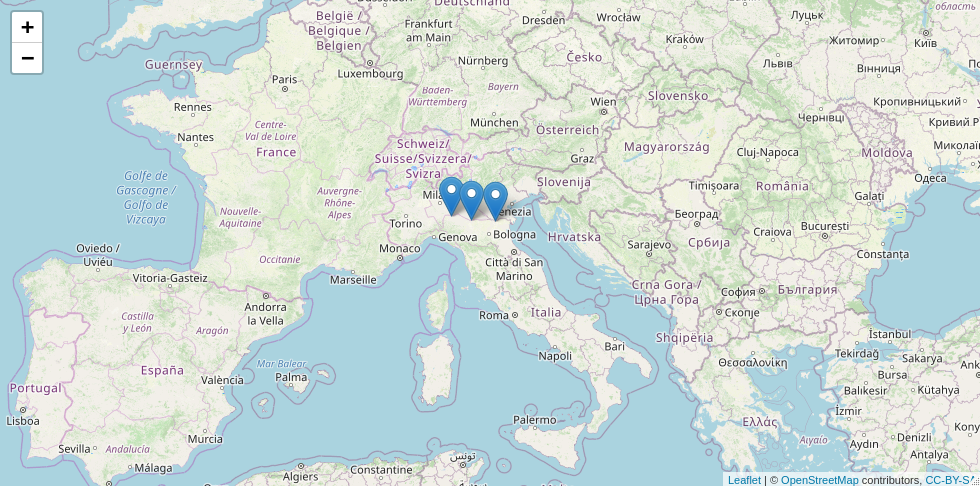

```{r init, echo=FALSE}
knitr::opts_chunk$set(
  comment = "#>",
  collapse = TRUE,
  warning = FALSE,
  message = FALSE,
  cache = FALSE,
  eval = FALSE
)
```

# Introduction

**hddtools** stands for Hydrological Data Discovery Tools. This R package is an open source project designed to facilitate access to a variety of online open data sources relevant for hydrologists and, in general, environmental scientists and practitioners. 

This typically implies the download of a metadata catalogue, selection of information needed, formal request for dataset(s), de-compression, conversion, manual filtering and parsing. All those operation are made more efficient by re-usable functions. 

Depending on the data license, functions can provide offline and/or online modes. When redistribution is allowed, for instance, a copy of the dataset is cached within the package and updated twice a year. This is the fastest option and also allows offline use of package's functions. When re-distribution is not allowed, only online mode is provided.

## Installation
Get the released version from CRAN:
  
```{r installation1}
install.packages("hddtools")
```

Or the development version from github using [devtools](https://github.com/hadley/devtools):
  
```{r installation2}
devtools::install_github("ropensci/hddtools")
```

Load the hddtools package:
  
```{r loading, eval = TRUE}
library("hddtools")
```

## Data sources and Functions

The functions provided can retrieve hydrological information from a variety of data providers.
To filter the data, it is advisable to use the package `dplyr`.

```{r dplyr, eval = TRUE}
library("dplyr")
```

### The Koppen Climate Classification map
The Koppen Climate Classification is the most widely used system for classifying the world's climates. Its categories are based on the annual and monthly averages of temperature and precipitation. It was first updated by Rudolf Geiger in 1961, then by Kottek et al. (2006), Peel et al. (2007) and then by Rubel et al. (2010). 

The package hddtools contains a function to identify the updated Koppen-Greiger climate zone, given a bounding box.

```{r KGClimateClass1, eval = TRUE}
# Define a bounding box
areaBox <- raster::extent(-10, 5, 48, 62)

# Extract climate zones from Peel's map:
KGClimateClass(areaBox = areaBox, updatedBy = "Peel")
```

```{r KGClimateClass2, eval = TRUE}
# Extract climate zones from Kottek's map:
KGClimateClass(areaBox = areaBox, updatedBy = "Kottek")
```

### The Global Runoff Data Centre
The Global Runoff Data Centre (GRDC) is an international archive hosted by the Federal Institute of Hydrology in Koblenz, Germany. The Centre operates under the auspices of the World Meteorological Organisation and retains services and datasets for all the major rivers in the world. Catalogue, kml files and the product Long-Term Mean Monthly Discharges are open data and accessible via the hddtools.

Information on all the GRDC stations can be retrieved using the function `catalogueGRDC` with no input arguments, as in the examle below:  
```{r catalogueGRDC1, eval = FALSE}
# GRDC full catalogue
GRDC_catalogue <- catalogueGRDC()
```

It is advisable to use the package `dplyr` for convenient filtering, some examples are provided below.

```{r catalogueGRDC2, eval = FALSE}
# Filter GRDC catalogue based on a country code
GRDC_catalogue %>%
  filter(country == "IT")

# Filter GRDC catalogue based on rivername
GRDC_catalogue %>%
  filter(river == "PO, FIUME")

# Filter GRDC catalogue based on which daily data is available since 2000
GRDC_catalogue %>%
  filter(d_start >= 2000)

# Filter the catalogue based on a geographical bounding box
GRDC_catalogue %>%
  filter(between(x = long, left = -10, right = 5),
         between(x = lat, left = 48, right = 62))

# Combine filtering criteria
GRDC_catalogue %>%
  filter(between(x = long, left = -10, right = 5),
         between(x = lat, left = 48, right = 62),
         d_start >= 2000,
         area > 1000)
```

The GRDC catalogue (or a subset) can be used to create a map.
```{r catalogueGRDC7, eval = FALSE}
# Visualise outlets on an interactive map
library(leaflet)
leaflet(data = GRDC_catalogue %>% filter(river == "PO, FIUME")) %>%
  addTiles() %>%  # Add default OpenStreetMap map tiles
  addMarkers(~long, ~lat, popup = ~station)
```


### Top-Down modelling Working Group (Data60UK and MOPEX)
The Top-Down modelling Working Group (TDWG) for the Prediction in Ungauged Basins (PUB) Decade (2003-2012) is an initiative of the International Association of Hydrological Sciences (IAHS) which collected datasets for hydrological modelling free-of-charge, available [here](http://tdwg.catchment.org/datasets.html). This package provides a common interface to retrieve, browse and filter information.

#### The Data60UK dataset
The Data60UK initiative collated datasets of areal precipitation and streamflow discharge across 61 gauging sites in England and Wales (UK). The database was prepared from source databases for research purposes, with the intention to make it re-usable. This is now available in the public domain free of charge. 

The hddtools contain two functions to interact with this database: one to retreive the catalogue and another to retreive time series of areal precipitation and streamflow discharge.

```{r catalogueData60UK1, eval = TRUE}
# Data60UK full catalogue
Data60UK_catalogue_all <- catalogueData60UK()

# Filter Data60UK catalogue based on bounding box
areaBox <- raster::extent(-4, -3, 51, 53)
Data60UK_catalogue_bbox <- catalogueData60UK(areaBox = areaBox)
```

```{r catalogueData60UK2}
# Visualise outlets on an interactive map
library(leaflet)
leaflet(data = Data60UK_catalogue_bbox) %>%
  addTiles() %>%  # Add default OpenStreetMap map tiles
  addMarkers(~Longitude, ~Latitude, popup = ~Location)
```


```{r catalogueData60UK3, eval = TRUE, message = FALSE, fig.width = 7, fig.height = 7}
# Extract time series 
id <- catalogueData60UK()$id[1]

# Extract only the time series
MorwickTS <- tsData60UK(id)
```

#### MOPEX
The MOPEX dataset contains river basin characteristics and data for hundreds of river basins from a range of climates in the US. The catalogue can be retrieved as follows:
```{r MOPEX_meta, eval = TRUE, message = FALSE, fig.width = 7, fig.height = 7}
# MOPEX full catalogue
MOPEX_catalogue <- catalogueMOPEX()

# Extract data within a geographic bounding box
MOPEX_catalogue %>%
  filter(dplyr::between(x = Longitude, left = -95, right = -92),
         dplyr::between(x = Latitude, left = 37, right = 41))
```

```{r MOPEX_meta2, eval = FALSE, message = FALSE, fig.width = 7, fig.height = 7}
# Get stations with recondings in the period 1st Jan to 31st Dec 1995
MOPEX_catalogue %>%
  filter(Date_start <= as.Date("1995-01-01"),
         Date_end >= as.Date("1995-12-31"))

# Get only catchments within NC
MOPEX_catalogue %>%
  filter(State == "NC")
```

For each station, historical hydrometeorological data  can also be retrieved.

```{r MOPEX_data, eval = TRUE, message = FALSE, fig.width = 7, fig.height = 7}
# Take the first record in the catalogue
river_metadata <- MOPEX_catalogue[1,]

# Get corresponding time series
river_ts <- tsMOPEX(id = river_metadata$USGS_ID)

# Extract data between 1st Jan and 31st December 1948
river_ts_shorter <- window(river_ts,
                           start = as.Date("1948-01-01"),
                           end = as.Date("1948-12-31"))

# Plot
plot(river_ts_shorter,
     main = river_metadata$Name,
     xlab = "",
     ylab = c("P [mm/day]","E [mm/day]", "Q [mm/day]", "Tmax [C]","Tmin [C]"))
```

### SEPA river level data
The Scottish Environment Protection Agency (SEPA) manages river level data for hundreds of gauging stations in the UK. The catalogue of stations is derived from the list here:
https://www2.sepa.org.uk/waterlevels/CSVs/SEPA_River_Levels_Web.csv.

```{r SEPA1, eval = TRUE}
# SEPA catalogue
SEPA_catalogue <- catalogueSEPA()
```

The time series of the last few days is available from SEPA website and can be downloaded using the following function:
```{r SEPA2, eval = TRUE, message = FALSE, fig.width = 7}
# Take the first record in the catalogue
Perth_metadata <- SEPA_catalogue[1,]

# Single time series extraction
Perth_ts <- tsSEPA(id = Perth_metadata$LOCATION_CODE)

# Plot
plot(Perth_ts,
     main = Perth_metadata$STATION_NAME,
     xlab = "",
     ylab = "Water level [m]")

# Get only catchments with area above 4000 Km2
SEPA_catalogue %>%
  filter(CATCHMENT_AREA >= 4000)

# Get only catchments within river Ayr
SEPA_catalogue %>%
  filter(RIVER_NAME == "Ayr")
```

Plese note that these data are updated every 15 minutes and the code will always generate different plots. 
```{r SEPA3, eval=FALSE, message = FALSE, fig.width = 7}
# Multiple time series extraction
y <- tsSEPA(id = c("234253", "234174", "234305"))

plot(y[[1]], ylim = c(0, max(y[[1]], y[[2]], y[[3]])), 
     xlab = "", ylab = "Water level [m]")
lines(y[[2]], col = "red")
lines(y[[3]], col = "blue")
```
